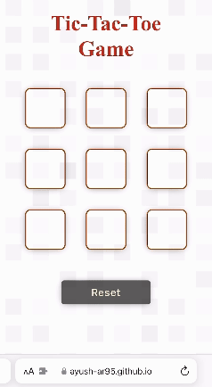
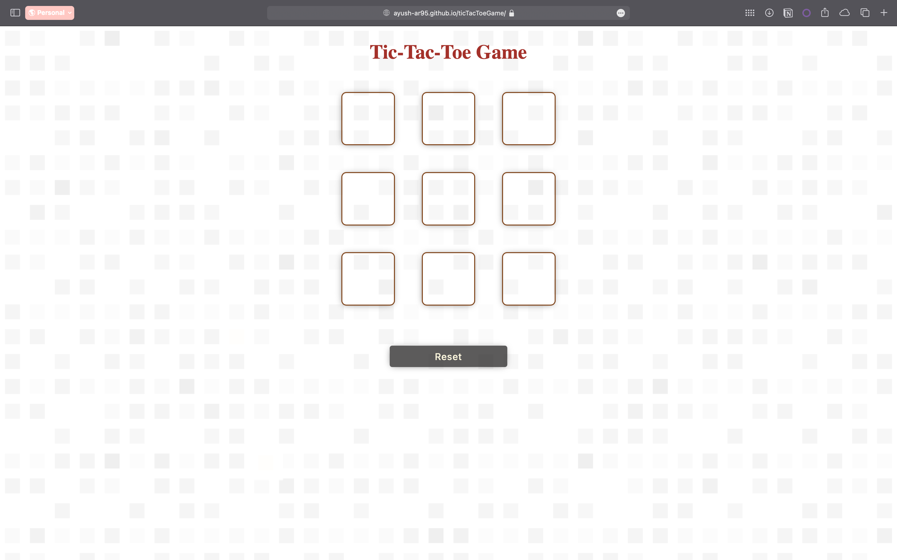
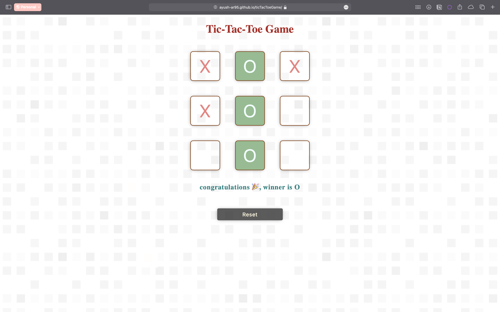
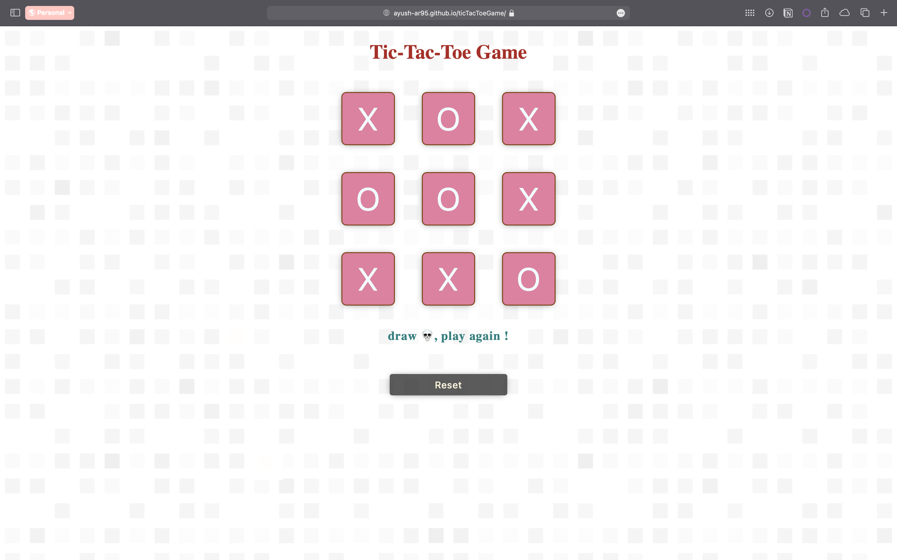

# Tic-Tac-Toe Game

## Overview
This project is a simple implementation of the classic Tic-Tac-Toe game using HTML, CSS, and JavaScript. The game allows two players to take turns marking spaces in a 3×3 grid. The player who succeeds in placing three of their marks in a horizontal, vertical, or diagonal row wins the game.

### Key Features
- **Interactive Gameplay** : Players can click on the game boxes to make their moves.
- **Winner Announcement** : A dialog box appears above the reset button to announce the winner.
- **Reset Functionality** : A reset button allows players to restart the game at any time.
- **Responsive Design** : The game layout is responsive and works well on different screen sizes.

## Screenshots

### mobile :

### web :

## Project Structure
1. index.html: The main HTML file that contains the structure of the game.
2. styles.css: The CSS file that styles the game elements.
3. myscript.js: The JavaScript file that contains the game logic.

## How to Run
1. Clone the repository.
2. Open index.html in a web browser.